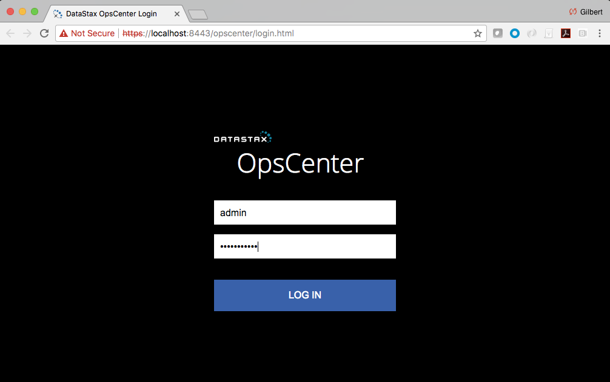
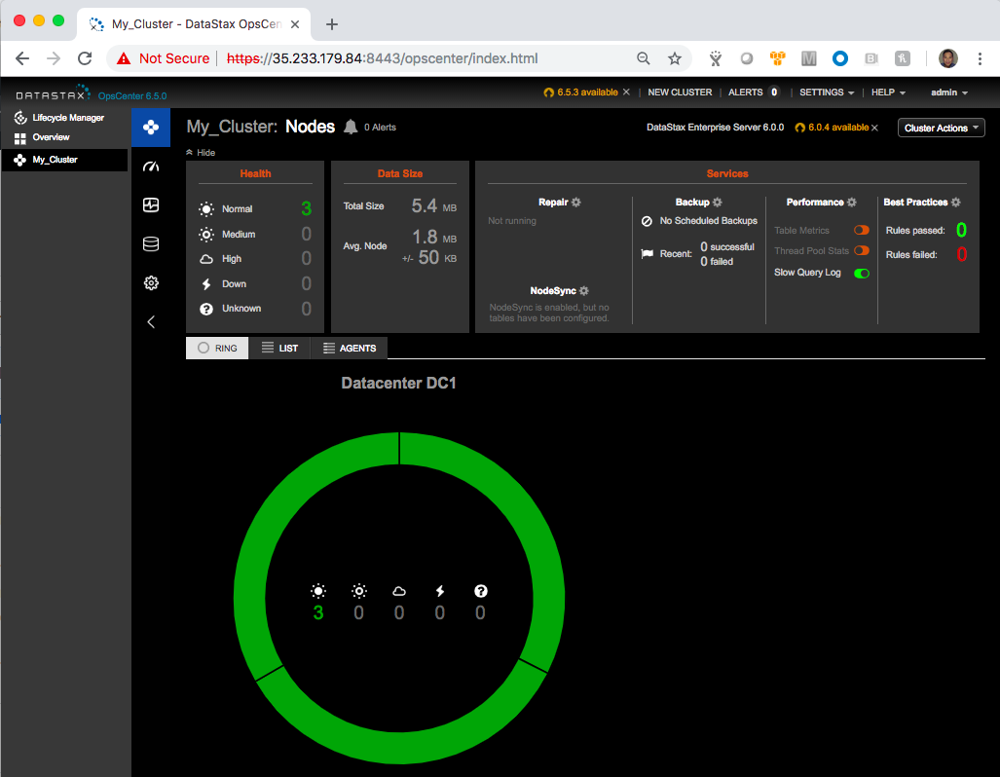
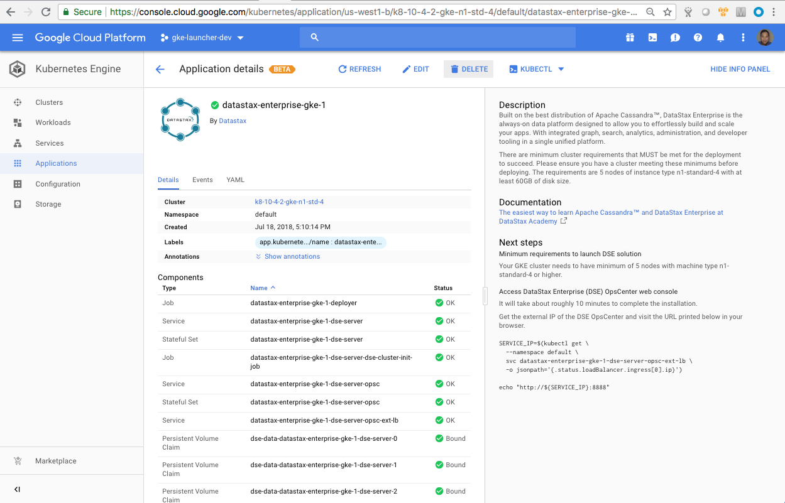

## Click to deploy DataStax Enterprise (DSE) on Google Kubernetes Engine (GKE)

This document provides instructions for deploying and decommissioning Datastax Enterprise (DSE) as a Kubernetes app in a GKE cluster or through the GCP Marketplace.

## IMPORTANT NOTE
There are minimum cluster requirements that MUST be met for the deployment to succeed. Please ensure you have a GKE cluster meeting these minimums before deploying. The requirements are >**5 nodes of instance type n1-standard-4 with at least 60GB of disk size for each DSE node** in either options above.

## Installation

You can either choose to deploy DSE via GCP Marketplace [here](https://console.cloud.google.com/marketplace/details/datastax-public/datastax-enterprise-gke) or follow the instructions below.  Once complete, you can proceed to the next [section](#verify_deployment) to verify your deployment status.

Run the following command to create a similar GKE cluster:
```
$ gcloud container clusters create k8-10-9-3-gke-n1-std-4 --cluster-version=1.10.9-gke.3 --zone us-west1-b --machine-type n1-standard-4  --num-nodes 5
```
Run the following command to update a kubeconfig file with appropriate credentials and endpoint information to point kubectl at the GKE cluster created above:
```
$ gcloud container clusters get-credentials k8-10-9-3-gke-n1-std-4 --zone us-west1-b
```
Run the following command to download the repo source to deploy DSE:
```
$ git clone https://github.com/DSPN/click-to-deploy-dse-gke 
$ cd click-to-deploy-dse-gke
```
Run the following command to deploy DSE:
```
$ export APP_INSTANCE_NAME=dse
$ export NAMESPACE=default
$ kubectl config set-context $(kubectl config current-context) --namespace=$NAMESPACE
$ helm template ./dse -n $APP_INSTANCE_NAME --namespace $NAMESPACE > expanded.yaml
$ kubectl apply -f expanded.yaml
```

### <a id="verify_deployment">Verify the status of your DataStax Enterprise deployment
If your deployment is successful, you can check the status of your DataStax Enterprise cluster using the **nodetool status** command as follows:
```
$ kubectl exec -it "${APP_INSTANCE_NAME}-dse-server-0" --namespace "${NAMESPACE}" nodetool status
```
Sample output for a 3-node DSE cluster as shown below:
```
Datacenter: Cassandra
=====================
Status=Up/Down
|/ State=Normal/Leaving/Joining/Moving
--  Address     Load       Tokens       Owns    Host ID                               Rack
UN  10.16.2.16  924.34 KiB  256          ?       29a8e88d-4dc4-4981-bee6-186c399a2a9d  rack1
UN  10.16.1.35  896.32 KiB  256          ?       f7ac0e87-7cd5-475b-a0a9-e9a0e73e2174  rack1
UN  10.16.0.37  935.8 KiB  256          ?       1c818e6c-c8fd-4f4e-a412-7aff5da18978  rack1
```

### Accessing DataStax Enterprise cloud database via cqlsh
You can run the following commands to access your DataStax Enterprise server via cqlsh as follows:
```
$ kubectl exec -it "${APP_INSTANCE_NAME}-dse-server-0" --namespace "${NAMESPACE}" /bin/bash
$ cqlsh
```

### Accessing Opscenter
Find the EXTERNAL-IP of ${APP_INSTANCE_NAME}-dse-server-opsc-ext-lb using "kubectl get service" and point your browser at the URL as follows:
```
SERVICE_IP=$(kubectl get \
  --namespace "${NAMESPACE}" \
  svc "${APP_INSTANCE_NAME}-dse-server-opsc-ext-lb" \
  -o jsonpath='{.status.loadBalancer.ingress[0].ip}')

echo "https://${SERVICE_IP}:8443"
```
The OpsCenter instance uses a self-signed SSL certificate, so you will need to accept the certificate exception before you can see the OpsCenter's login page. Then log in using username, "admin" and password produced by running the following command:
```
echo -n `(kubectl get \
  --namespace "${NAMESPACE}" \
  secret "${APP_INSTANCE_NAME}-dse-server-opsc-admin-pwd-secret" \
  -o jsonpath='{.data.password}')` \
  | base64 -D | awk '{ print $1; }'
```
You should see the console of DataStax Enterprise OpsCenter like below:




## Scaling the DataStax Enterprise cluster
### Scaling up the DataStax Enterprise cluster
By default, the DataStax Enterprise Kubernetes app is deployed using 3 replicas (equivalent to 3 DSE nodes). To increase the number of replicas (the number of DSE nodes), use the following command:
```
kubectl scale statefulsets "$APP_INSTANCE_NAME-dse-server" \
  --namespace "$NAMESPACE" --replicas=[NEW_REPLICAS]
```
where [NEW_REPLICAS] is the new number.

### Scaling down the DataStax Enterprise cluster
You can manually scale down the DataStax Enterprise cluster using the following procedure.  On each node, you are required to do the following steps starting from the highest-numbered pod of the DSE StatefulSet:
* Inside the DSE container, run $ nodetool decommission
* Scale down the StatefulSet by one, using the **$ kubectl scale statefulsets** command.
* Wait until the pod is removed from the cluster successfully.
* Remove any persistent volume claim(s) that belong to that replica (DSE node) using the **$ kubectl delete pvc** command.

Repeat this procedure until the DataStax Enterprise cluster has your desired number of pods (DSE nodes).


## Backup and restore
Will be provided in future releases


## Uninstall the DataStax Enterprise Kubernetes Application

If you use GCP Marketplace to deploy DSE, you can go to the the DataStax Enterprise Kubernetes **Application details** screen to **DELETE** the application.  See below our sample screen:


But, if you use the **expanded.yaml** above to deploy your DSE cluster, you can run the following command to uninstall our DSE Kubernetes application:
```
$ kubectl delete -f expanded.yaml
``` 

### Deleting the persistent values of your deployment
By design, deleting StatefulSets in Kubernetes does not remove PersistentVolumeClaims that were attached to their Pods.  This prevents users from losing their stateful data accidentally.  To remove the PersistentVolumeClaims with their attached persistent disks, you need to run the following commands:
```
export APP_INSTANCE_NAME=<your-app-instance-name>
export NAMESPACE=<namespace-for-your-deployment>

kubectl delete persistentvolumeclaims \
  --namespace $NAMESPACE \
  --selector app.kubernetes.io/name=$APP_INSTANCE_NAME
```

## Delete the GKE cluster
If you follow this guide to deploy a GKE cluster and you no longer need it, you can run a similar command like the following to remove the cluster:
```
$ gcloud container clusters delete k8-10-9-3-gke-n1-std-4 --zone us-west1-b
```
